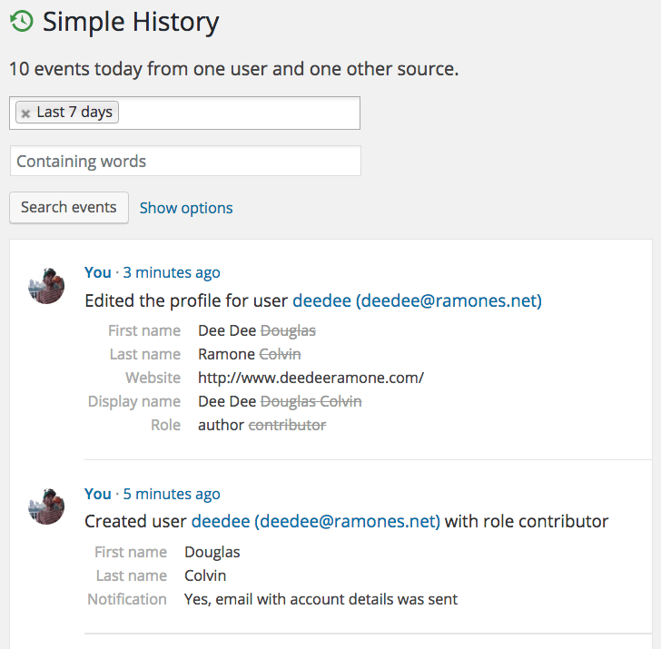

#  Simple History

  

A WordPress activity log for what matters

Simple History is a WordPress audit log plugin that logs various things that occur in WordPress and then presents those events in a very nice GUI.  
It's great way to view user activity and keep an eye on what the admin users of a website are doing.

## Installation

Download from [WordPress.org](https://wordpress.org/plugins/simple-history/) and activate.

## Usage

### Viewing history events

This screenshot show the user activity feed:

- It has an active **filter/search in use**:
    - only show changes performed by a specific user
    - it only shows event that are of type post and pages and media (i.e. images & other uploads)
- A thumbnail is shown for the image that is uploaded


### Events with different severity

Simple History uses the log levels specified in the [PHP PSR-3 standard](https://www.php-fig.org/psr/psr-3/).

### Quick diff lets you see what's changed


### Events have context with extra details

Each logged event can include useful rich formatted extra information. For example: a plugin install can contain author info and a the url to the plugin, and an uploaded image can contain a thumbnail of the image.



## Plugin API

Developers can easily log their own things using a simple API:

```php
<?php

// This is the easiest and safest way to add messages to the log
// If the plugin is disabled this way will not generate in any error
apply_filters('simple_history_log', 'This is a logged message');

// Or with some context and with log level debug:
apply_filters(
    'simple_history_log',
    'My message about something',
    [
        'debugThing' => $myThingThatIWantIncludedInTheLoggedEvent,
        'anotherThing' => $anotherThing
    ],
    'debug'
);

// Or just debug a message quickly
apply_filters('simple_history_log_debug', 'My debug message');

// You can also use functions/methods to add events to the log
SimpleLogger()->info("This is a message sent to the log");

// Add events of different severity
SimpleLogger()->info("User admin edited page 'About our company'");
SimpleLogger()->warning("User 'Jessie' deleted user 'Kim'");
SimpleLogger()->debug("Ok, cron job is running!");
```

You will find more examples in the [examples.php](./examples/examples.php) file.

## Development

### Running tests

See the [README](./tests/readme.md) in `tests` directory.

## Sponsors

Support the free version of Simple History by becoming a sponsor.
You can sponsor using [PayPal](https://www.paypal.com/paypalme/eskapism) or [becoming a GitHub Sponsor](https://github.com/sponsors/bonny).
